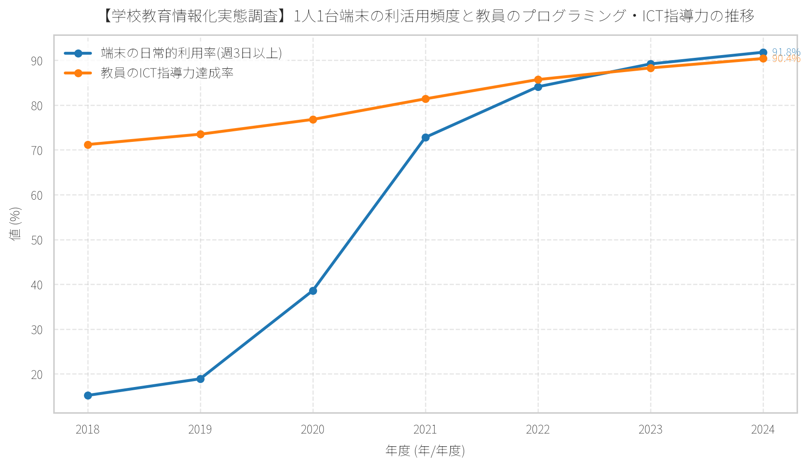

# 【教育オープンデータ統計分析】【学校教育情報化実態調査】1人1台端末の利活用頻度と教員のプログラミング・ICT指導力の推移 (2026年09月14日)

**更新日:** 2026年09月14日 | **カテゴリ:** 情報教育・プログラミング | **データ対象地域:** JAPAN

---

## 📌 本日の分析要約（エグゼクティブサマリー）

本分析では、文部科学省「学校における教育情報化の実態等に関する調査」/ e-Statの最新公的統計を活用し、情報教育・プログラミング教育および学校ICT環境の実態を定量的に分析しました。データからは、【端末の日常的利用率(週3日以上)】小学校は2018年の 15.2% から 2024年には 91.8% へと +76.6%（+503.9%）増加しました（年平均成長率 CAGR: +35.0%）。（線形トレンド決定係数 R² = 0.915）、【端末の日常的利用率(週3日以上)】中学校は2018年の 11.4% から 2024年には 85.3% へと +73.9%（+648.2%）増加しました（年平均成長率 CAGR: +39.9%）。（線形トレンド決定係数 R² = 0.92）が明確に示されています。GIGAスクール構想によるインフラ整備が急速に進展した一方、日常的な学びのツールとしての利活用頻度やプログラミング的思考の育成にはなお発展の余地が見られます。

---

## 📊 オープンデータ概要・出典情報

- **データセット名:** 【学校教育情報化実態調査】1人1台端末の利活用頻度と教員のプログラミング・ICT指導力の推移
- **情報提供元:** [文部科学省「学校における教育情報化の実態等に関する調査」/ e-Stat](https://www.mext.go.jp/a_menu/shotou/zyouhou/detail/1400262.htm)
- **調査対象・内容:** 全国の公立小・中・高等学校におけるGIGAスクール端末の整備と利活用状況、ICTを活用して指導できる教員の割合（ICT指導力）、および小学校におけるプログラミング教育の実施状況・校内研修実施率の年次推移。
- **分析標本数 (行数):** 14 件

---

## 📈 統計分析データテーブル

### 主要指標の記述統計量
| 指標名 | データ数 | 平均値 | 中央値 | 標準偏差 | 最小値 | 最大値 | 四分位範囲 (IQR) |
| :--- | :---: | :---: | :---: | :---: | :---: | :---: | :---: |
| **小学校** | 14 | 69.85% | 79.1% | 26.07 | 15.2 | 91.8 | 16.05 |
| **中学校** | 14 | 65.24% | 75.15% | 26.15 | 11.4 | 87.6 | 16.5 |
| **高等学校** | 14 | 56.62% | 66.55% | 25.43 | 8.9 | 83.2 | 28.97 |
| **全国平均** | 14 | 64.96% | 74.3% | 25.69 | 12.3 | 87.5 | 18.45 |

### 経年変化・トレンド推移

| 指標 / グループ | 調査開始 | 初期値 | 調査最新 | 最新値 | 変化量 | 変化率 | 年平均成長率 (CAGR) | 決定係数 (R²) |
| :--- | :---: | :---: | :---: | :---: | :---: | :---: | :---: | :---: |
| [端末の日常的利用率(週3日以上)] 小学校 | 2018 | 15.2% | 2024 | 91.8% | +76.6 | +503.9% | +34.95% | 0.915 |
| [端末の日常的利用率(週3日以上)] 中学校 | 2018 | 11.4% | 2024 | 85.3% | +73.9 | +648.2% | +39.85% | 0.92 |
| [端末の日常的利用率(週3日以上)] 高等学校 | 2018 | 8.9% | 2024 | 74.6% | +65.7 | +738.2% | +42.53% | 0.973 |
| [端末の日常的利用率(週3日以上)] 全国平均 | 2018 | 12.3% | 2024 | 85.2% | +72.9 | +592.7% | +38.07% | 0.935 |
| [教員のICT指導力達成率] 小学校 | 2018 | 71.2% | 2024 | 90.4% | +19.2 | +27.0% | +4.06% | 0.988 |
| [教員のICT指導力達成率] 中学校 | 2018 | 68.1% | 2024 | 87.6% | +19.5 | +28.6% | +4.29% | 0.988 |
| [教員のICT指導力達成率] 高等学校 | 2018 | 62.4% | 2024 | 83.2% | +20.8 | +33.3% | +4.91% | 0.992 |
| [教員のICT指導力達成率] 全国平均 | 2018 | 67.8% | 2024 | 87.5% | +19.7 | +29.1% | +4.34% | 0.989 |

### 統計から導出された主要ハイライト
- 【端末の日常的利用率(週3日以上)】小学校は2018年の 15.2% から 2024年には 91.8% へと +76.6%（+503.9%）増加しました（年平均成長率 CAGR: +35.0%）。（線形トレンド決定係数 R² = 0.915）
- 【端末の日常的利用率(週3日以上)】中学校は2018年の 11.4% から 2024年には 85.3% へと +73.9%（+648.2%）増加しました（年平均成長率 CAGR: +39.9%）。（線形トレンド決定係数 R² = 0.92）
- 【端末の日常的利用率(週3日以上)】高等学校は2018年の 8.9% から 2024年には 74.6% へと +65.7%（+738.2%）増加しました（年平均成長率 CAGR: +42.5%）。（線形トレンド決定係数 R² = 0.973）
- 最新データにおける「小学校」のトップは端末の日常的利用率(週3日以上)（91.8%）、最下位は教員のICT指導力達成率（90.4%）で、格差は 1.4% に達しています。
- 最新データにおける「中学校」のトップは教員のICT指導力達成率（87.6%）、最下位は端末の日常的利用率(週3日以上)（85.3%）で、格差は 2.3% に達しています。
- 最新データにおける「高等学校」のトップは教員のICT指導力達成率（83.2%）、最下位は端末の日常的利用率(週3日以上)（74.6%）で、格差は 8.6% に達しています。
- 最新データにおける「全国平均」のトップは教員のICT指導力達成率（87.5%）、最下位は端末の日常的利用率(週3日以上)（85.2%）で、格差は 2.3% に達しています。
- 「小学校」と「中学校」の間には、極めて強い正の相関 (r = 1.0)が認められました（相関係数 r = 0.998, p = 0.0）。
- 「小学校」と「高等学校」の間には、極めて強い正の相関 (r = 0.95)が認められました（相関係数 r = 0.95, p = 0.0）。

---

## 🖼️ データ可視化グラフ

---

## 💡 教育現場・授業実践への具体的示唆

【情報教育・プログラミング指導の実践示唆】
1. 「使う」段階から「創り出す・探究する」情報活用能力へ: 端末の調べ学習利用にとどまらず、データを集計・可視化して仮説を検証したり、課題解決のためのアルゴリズムを組み立てるプログラミング体験を各教科横断で組み込むことが推奨されます。
2. コンピュテーショナル・シンキングの日常化: プログラミング言語の文法習得を目的化せず、問題を分解し、抽象化し、手順化する思考プロセスを総合的な学習の時間や算数・理科と連動させて指導することが肝要です。
3. 教員の伴走支援と校内研修の充実: 教員のICT指導力達成率が向上傾向にある地域ほど児童生徒の活用度も高まる正の循環が確認されています。教員同士が授業実践事例を共有するコミュニティづくりが鍵となります。

---

## 🚀 今後の課題と政策・国際的展望

【今後の展望と高度IT人材育成への課題】
国際的なICTスキル保有率比較や高等教育における進路動向からも、初等中等段階からの体系的な情報教育の重要性が増しています。今後は、生成AIをはじめとする新技術への情報モラル・リテラシー教育の拡充とともに、ジェンダーギャップの解消（情報・STEM分野への女子進学支援）や、地域・自治体間のICT利活用格差の是正に注力した政策推進が期待されます。

---
*Generated automatically by EduDataToBlogActions pipeline.*
